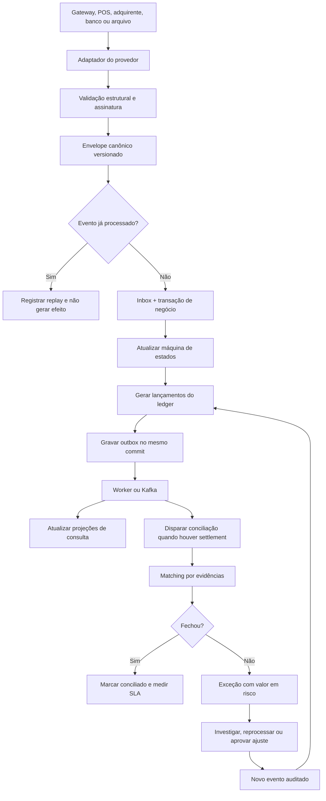

# Fluxos ponta a ponta

## Fluxo principal



## Detalhamento de cada etapa

1. **Fonte:** o sistema externo fornece webhook, consulta, arquivo ou retorno bancário.
2. **Adaptador:** autentica, aplica rate limit, traduz nomes/status/valores e anexa `provider` e `providerAccount`.
3. **Validação:** verifica assinatura, schema, moeda, IDs mínimos, timestamps e limites; payload inválido vai para rejeição auditada.
4. **Envelope:** inclui tipo, versão, `eventId`, IDs externos, `occurredAt`, `receivedAt`, `traceId` e hash do payload.
5. **Deduplicação:** `provider + providerAccount + externalEventId` ou chave equivalente é única; replay não reaplica dinheiro.
6. **Estado:** a transição é validada contra a máquina; evento tardio é aceito como evidência se não causar transição inválida.
7. **Ledger:** cada impacto gera débitos e créditos balanceados por moeda, conta e referência.
8. **Outbox:** o evento derivado é salvo no mesmo commit; se a publicação falhar, o worker tenta novamente.
9. **Projeção:** consultas rápidas são atualizadas de forma reprocessável e não substituem o ledger.
10. **Settlement:** arquivo/lote passa por ingestão, checksum, schema, quarentena e processamento por partição.
11. **Matching:** tenta ID exato, referência composta, valor/data/janela e somente depois revisão manual.
12. **Exceção:** registra categoria, severidade, valor em risco, evidências, regra, SLA e responsável.
13. **Resolução:** pode encerrar, pedir nova fonte, reprocessar ou gerar ajuste com permissão; nunca altera o histórico.

## Fluxo Axxon e fluxo sem Axxon

O caminho é idêntico. O que muda é somente a borda:

```text
Axxon webhook/API/arquivo ─┐
Outro provedor ─────────────┼─> adaptador -> evento canônico -> mesmo núcleo
Simulador local ────────────┘
```

Assim, Axxon pode ser ativada por configuração e credenciais sem tornar o produto dependente dela.

## Fluxos de falha

- **Evento duplicado:** responder sucesso técnico, registrar replay e não duplicar ledger.
- **Evento fora de ordem:** guardar evidência, recalcular projeção e abrir exceção apenas se a política exigir.
- **Payload inválido:** quarentenar com erro de schema e permitir correção/reenvio.
- **Timeout do provedor:** manter comando pendente, usar idempotência e consultar status antes de repetir.
- **Falha de publicação:** outbox permanece pendente; alerta após backoff; nenhum dado financeiro é perdido.
- **Arquivo parcial:** não conciliar lote incompleto; esperar fechamento/checksum ou abrir exceção de ingestão.
- **Divergência financeira:** bloquear ação automática por padrão e apresentar decomposição dos valores.
